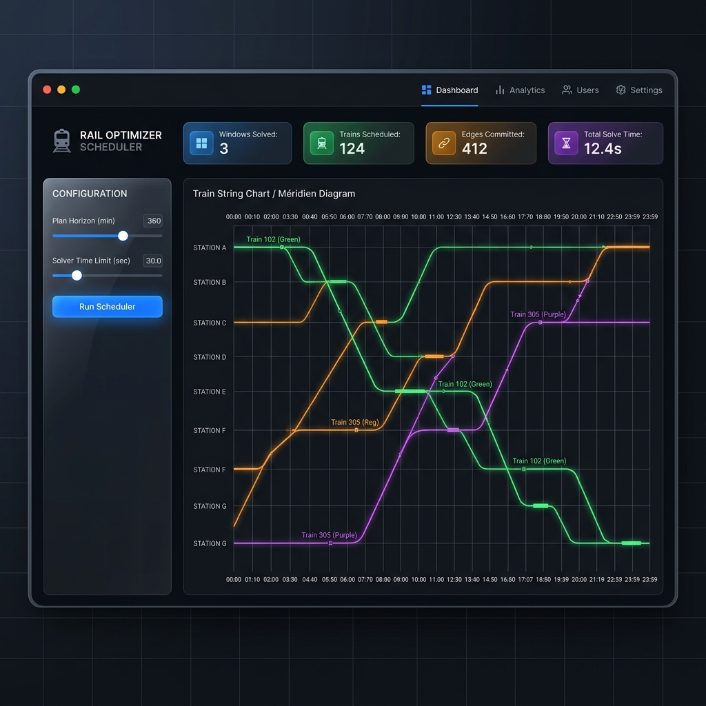

# Kottavalasa-Palasa (KTV-PSA) Corridor Freight Scheduler

A high-performance, physics-aware discrete Time-Space Network (TSN) scheduling engine designed to maximize freight throughput along the Kottavalasa-Palasa railway corridor.

| CI Quality | License | Build Status |
| :---: | :---: | :---: |
| [](https://github.com/Nayan10001/Railway_Optimizer/actions) | [](LICENSE) | [](https://github.com/Nayan10001/Railway_Optimizer/actions) |



---

## Quick Start

Get the scheduler running locally in under five minutes.

```bash
# 1. Clone the repository
git clone https://github.com/Nayan10001/Railway_Optimizer.git
cd Railway_Optimizer

# 2. Set up Python virtual environment
python -m venv .venv
# Activate on Windows:
.venv\Scripts\activate
# Activate on Linux/macOS:
source .venv/bin/activate

# 3. Install required Python packages
pip install -r requirements.txt

# 4. Compile the Rust native extension
maturin develop --release

# 5. Run the Streamlit optimization dashboard
streamlit run app.py
```

---

## Prerequisites

To build and run the scheduler engine, ensure you have the following installed:

*   **Python 3.8+** (Python 3.10 or 3.12 is highly recommended)
*   **Rust Toolchain** (Edition 2024, including `cargo` and `rustc`)
*   A C++ compiler matching your platform (e.g., MSVC on Windows, GCC/Clang on Unix-like systems) to build the native module.

---

## Installation & Usage

### 1. Environment Setup

Configure a standard virtual environment and install all dependencies:
```bash
python -m venv .venv
.venv\Scripts\activate
pip install --upgrade pip
pip install -r requirements.txt
```

### 2. Building the Rust Native Module

The performance-critical bitmasking, traction physics calculations, and Clear Standing Length (MANCSR) checks are written in native Rust and exposed to Python via PyO3. 

Run `maturin` to compile the library and install it into your active virtual environment:
```bash
# Development compilation
maturin develop

# Optimized release compilation (recommended for large datasets)
maturin develop --release
```

### 3. Running the Optimizer CLI

Use the command-line interface to execute optimization runs directly:
```bash
python main.py --plot --total-horizon 720
```

#### CLI Arguments:
*   `--data-dir`: Path to the data directory (default: `data`).
*   `--total-horizon`: Total planning horizon in minutes (default: `1440`).
*   `--plan-horizon`: Rolling window size in minutes (default: `360`).
*   `--freeze-horizon`: Execution step/freeze size in minutes (default: `120`).
*   `--time-limit`: Solver time limit per window in seconds (default: `120.0`).
*   `--mip-gap`: MIP gap tolerance target (default: `0.01`).
*   `--plot`: Generate a Plotly train string chart (Méridien diagram) HTML visualization.

### 4. Running the Streamlit Dashboard

Run the interactive dashboard to adjust model parameters in real-time and visualize string charts:
```bash
streamlit run app.py
```

---

## Documentation

Comprehensive details concerning mathematical formulations, data schemas, and software architecture are available in the [doc/](doc) directory:

*   [doc/architecture.md](doc/architecture.md): Contains the detailed Master Implementation Plan. This includes the formulation of the Multi-Commodity Network Flow Problem with Disjunctive Side Constraints, Clique Constraints, and the Rolling Horizon framework details.
*   [doc/data_dictionary.md](doc/data_dictionary.md): Details the CSV data structure schemas for the inputs including freight manifests, passenger schedule entries, blocks, stations, and route sequences.

---

## Contributing

We welcome contributions to improve the scheduling algorithms, frontend dashboard, and physics engines. 

Please review [CONTRIBUTING.md](CONTRIBUTING.md) for standard guidelines, and adhere to our [CODE_OF_CONDUCT.md](CODE_OF_CONDUCT.md) when interacting with the community.

### Running Tests

Ensure all tests pass before submitting a Pull Request:
```bash
# Run the Python test suite
pytest

# Run the native module Rust smoke tests
python tests/test_native_smoke.py
```

---

## License

This project is licensed under the MIT License. See [LICENSE](LICENSE) for details.

---

## Support/Community

*   **Issue Tracker**: Open bug reports or feature suggestions on our [GitHub Issues](https://github.com/Nayan10001/Railway_Optimizer/issues) page.
*   **Discussions**: Share feedback or ask questions in the [GitHub Discussions](https://github.com/Nayan10001/Railway_Optimizer/discussions) section.