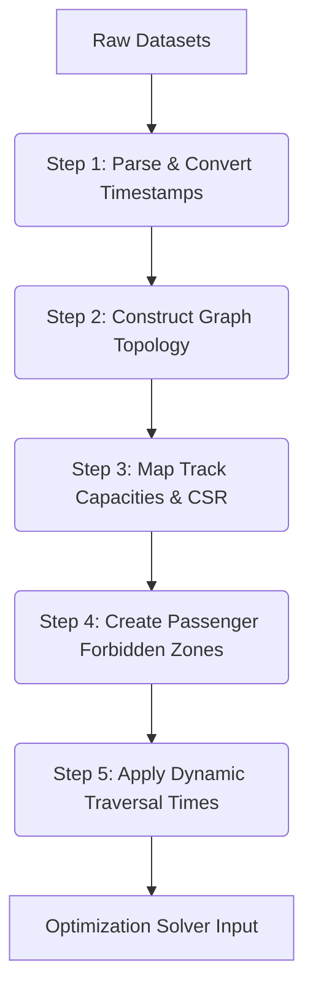

# Comprehensive Data Analysis Report: KTV–PSA Railway Corridor

This report provides a detailed, production-grade analysis of the railway scheduling and infrastructure datasets for the **Kottavalasa Junction (KTV) → Palasa (PSA)** corridor (~176.83 km, 22 stations). The data is categorized into four main components: **Freight**, **Passenger Schedules**, **Infrastructure (Topology & Stations)**, and **Track Geometry (Curves, Gradients & speed limits)**.

---

## 1. Directory Structure & File Inventory

The workspace datasets are organized as follows:

```
data/
├── Freight/
│   └── WAT_GOODS_TRAIN_AUG25_01082025_27082025 - WAT_GOODS_TRAIN_AUG25_01082025_27082025.csv
├── Route_Station/
│   ├── RouteSttnInfo.xlsx - KTV-PSA.csv
│   └── RouteSttnInfo.xlsx - PSA-KTV.csv
├── infrastructure/
│   ├── KTV-PSA-Infra.xlsx - BLOCKSCTN.csv
│   ├── KTV-PSA-Infra.xlsx - BLOCKSCTNLINE.csv
│   ├── KTV-PSA-Infra.xlsx - Connections.csv
│   ├── KTV-PSA-Infra.xlsx - Platform.csv
│   ├── KTV-PSA-Infra.xlsx - STATION.csv
│   └── KTV-PSA-Infra.xlsx - STTNLINE.csv
└── passenger/
    ├── KTV_PSA_Passenger_Schedule.xlsx - Curvature (KTV_PSA).csv
    ├── KTV_PSA_Passenger_Schedule.xlsx - Curvature (PSA-KTV).csv
    ├── KTV_PSA_Passenger_Schedule.xlsx - GRADIENT (KTV-PSA).csv
    ├── KTV_PSA_Passenger_Schedule.xlsx - GRADIENT (PSA-KTV).csv
    ├── KTV_PSA_Passenger_Schedule.xlsx - PSR (KTV-PSA).csv
    ├── KTV_PSA_Passenger_Schedule.xlsx - PSR (PSA-KTV).csv
    ├── KTV_PSA_Passenger_Schedule.xlsx - SCHEDULE-KTV-PSA.csv
    └── KTV_PSA_Passenger_Schedule.xlsx - TRAIN-KTV-PSA.csv
```

---

## 2. Freight Data Analysis (`data/Freight`)

### Dataset Overview
*   **File Name**: `WAT_GOODS_TRAIN_AUG25_01082025_27082025 - WAT_GOODS_TRAIN_AUG25_01082025_27082025.csv`
*   **File Size**: 16.48 MB
*   **Total Rows**: 95,219
*   **Unique Freight Loads (`LoadId`)**: 5,548
*   **Unique Rakes (`RakeId`)**: 1,852

### Schema and Key Columns
| Column | Type | Non-Null Count | Unique Values | Description / Key Sample |
|---|---|---|---|---|
| `LoadId` | object | 95,219 | 5,548 | Unique identifier for a loaded train journey. |
| `RakeId` | object | 95,219 | 1,852 | Physical wagon formation (rake) identifier. |
| `Source` | object | 95,219 | 408 | Origin station of the freight (e.g., `AB`). |
| `Destination` | object | 95,219 | 438 | Final destination station (e.g., `MGPV`). |
| `Load Type` | object | 95,219 | 37 | Wagon design category (e.g., `BOXNHL`, `BOXN`, `BCN`). |
| `Total Km` | float64 | 85,481 | 18,423 | Total planned journey distance in km. |
| `Block Section`| object | 95,219 | 1,574 | Current block section being traversed (e.g., `-DVD`). |
| `Block Hrs` | float64 | 89,671 | 1,210 | Duration spent traversing the block section (hours). |
| `Speed` | float64 | 95,219 | 6,841 | Average speed of the freight train in km/h. |
| `Commodity` | object | 65,600 | 60 | High-level commodity code (e.g., `IORE`, `PHC`, `IMCL`). |
| `Description` | object | 65,600 | 60 | Natural name of the cargo (e.g., `IRON ORE`, `POWER HOUSE COAL`). |
| `Sttn` | object | 95,219 | 136 | Current reporting station code (e.g., `DVD`). |
| `Arrival Time` | object | 95,219 | 34,061 | Timestamp of arrival at station (`DD/MM/YYYY HH:MM`). |
| `Depart Time` | object | 91,468 | 33,838 | Timestamp of departure from station (`DD/MM/YYYY HH:MM`). |

### High-Level Distributions & Insights
1.  **Commodity Breakdown (Top 5 by Row Count)**:
    *   **IORE** (Iron Ore): 15,601 rows (16.4%)
    *   **PHC** (Power House Coal): 10,576 rows (11.1%)
    *   **IMCL** (Imported Coal): 8,649 rows (9.1%)
    *   **CONT** (Container Cargo): 4,511 rows (4.7%)
    *   **IS** (Iron & Steel): 3,802 rows (4.0%)
    
    > [!TIP]
    > **Modeling Suggestion**: Commodities like `CONT` (Container) and `IS` (Iron & Steel) are high-revenue and time-sensitive. They should be assigned higher economic weights ($w_f$) in the optimization model than bulk commodities like Coal (`PHC`/`IMCL`) or Empty rakes.

2.  **Wagon Types (Load Type)**:
    *   **BOXNHL** / **BOXN** / **BOXNHL25T** / **BOXNS**: Open wagons used primarily for bulk freight like Coal and Ore, making up **over 61%** of all logs.
    *   **BCN**: Covered wagons for cement, food grains, and fertilizers (7.0%).
    *   **BLC**: Container flatcars (4.2%).

3.  **Traffic Flow Analysis**:
    *   The overwhelming majority of traffic resides within the Waltair division (`WAT -> WAT`: 34,801 records), but significant inter-divisional exchange exists (e.g., `WAT -> SBP`: 5,640 records; `WAT -> KUR`: 5,111 records).

---

## 3. Passenger Schedules Data Analysis (`data/passenger`)

### Dataset Overview
*   **Schedules File**: `KTV_PSA_Passenger_Schedule.xlsx - SCHEDULE-KTV-PSA.csv` (Size: 858 KB, 4,260 rows)
*   **Trains Metadata File**: `KTV_PSA_Passenger_Schedule.xlsx - TRAIN-KTV-PSA.csv` (Size: 26 KB, 250 rows)
*   **Total Unique Passenger Trains**: 250 scheduled trains

### Train Type Distribution
Passenger trains are categorised by speed and priority profiles:
*   **SUF** (Superfast Express): High-priority, high-speed passenger trains (e.g., mail/express).
*   **MEX / PEXP** (Express / Passenger Express): Medium-priority regional express trains.
*   **VNDB** (Vande Bharat Express): Ultra-high priority, fast acceleration/deceleration.
*   **PAS / MEMU**: Low-priority local commuter trains making stops at almost all stations.

### Timestamp Formats & The Offsets Problem
Unlike freight data, the passenger schedule arrival/departure values are stored as **integer seconds elapsed since a base midnight time**.
For instance:
*   `ARRIVAL = 142500` (represents $142,500$ seconds from the start of the service day, which can span past 24 hours for multi-day train schedules).
*   `DEPARTURE = 142920` (dwell time is calculated as $142,920 - 142,500 = 420$ seconds, or 7 minutes).

> [!IMPORTANT]
> **Temporal Normalization**: To prevent errors in time arithmetic, passenger seconds-from-midnight and freight standard timestamps must be normalized into a single continuous integer timeline in minutes:
> $$t_{\text{minutes}} = \lfloor t_{\text{seconds}} / 60 \rfloor$$
> For freight, the absolute timestamp must be mapped relative to a planning window's $T_0$.

---

## 4. Corridor Topology and Station Layouts (`data/Route_Station` & `data/infrastructure`)

### KTV–PSA Corridor Station Sequence
The corridor is ~176.8 km long with 22 stations. The physical sequence of stations, their cumulative distances, signal configurations, and track counts are mapped below:

```mermaid
graph TD
    KTV[KTV: 0.0 km | 3 Tracks] --> KPL[KPL: 7.74 km | 3 Tracks]
    KPL --> ALM[ALM: 16.97 km | 3 Tracks]
    ALM --> KUK[KUK: 24.08 km | 3 Tracks]
    KUK --> VZM[VZM: 34.73 km | 2 Tracks]
    VZM --> NML[NML: 46.47 km | 2 Tracks]
    NML --> GVI[GVI: 58.80 km | 2 Tracks]
    GVI --> CPP[CPP: 65.37 km | 2 Tracks]
    CPP --> BTVA[BTVA: 69.80 km | 2 Tracks]
    BTVA --> SGDM[SGDM: 78.64 km | 2 Tracks]
    SGDM --> PDU[PDU: 88.71 km | 2 Tracks]
    PDU --> DUSI[DUSI: 97.53 km | 2 Tracks]
    DUSI --> CHE[CHE: 103.99 km | 2 Tracks]
    CHE --> ULM[ULM: 114.03 km | 2 Tracks]
    ULM --> TIU[TIU: 123.66 km | 2 Tracks]
    TIU --> HCM[HCM: 129.09 km | 2 Tracks]
    HCM --> KBM[KBM: 137.38 km | 2 Tracks]
    KBM --> DGB[DGB: 145.36 km | 2 Tracks]
    DGB --> NWP[NWP: 151.30 km | 2 Tracks]
    NWP --> RMZ[RMZ: 158.31 km | 2 Tracks]
    RMZ --> PUN[PUN: 164.54 km | 2 Tracks]
    PUN --> PSA[PSA: 176.83 km | 0 Tracks/End]
```

### Signalling and Track Capacity Analysis
1.  **Block Sections (`BLOCKSCTN.csv`)**:
    *   **KTV to VZM Segment**: Predominantly **Automatic Track (AT)** signalling with 3 main lines (`MANNUMBLINES = 3`). This allows robust overtaking and high-density parallel running.
    *   **VZM to PSA Segment**: Predominantly **Automatic Block (AB)** signalling with 2 directional lines (`MANNUMBLINES = 2`). Same-direction trains must preserve a minimum headway ($H_b \approx 3\text{ to }5$ minutes), while opposite-direction trains are physically segregated on separate lines (no conflict).

2.  **Station Capacity & Loop Lines (`STTNLINE.csv` & `Platform.csv`)**:
    *   Stations like **Vizianagaram (VZM)** and **Kottavalasa (KTV)** act as massive yards with up to 9–10 parallel lines.
    *   Smaller stations typically possess 3–4 loops. 
    *   Wagon loop clear standing lengths (`MANCSR` column in `STTNLINE.csv`) range from 700m to 900m. This acts as a physical ceiling: a freight rake exceeding a station's loop CSR cannot be held at that station to let a faster passenger train pass.

---

## 5. Track Geometry and Restrictions (`data/passenger`)

### Ggradient Analysis (`GRADIENT (KTV-PSA).csv`)
*   **Total Logs**: 281 UP direction, 272 DN direction.
*   **Profile Types**: `LEVEL`, `FALL`, and `RISE`.
*   **Impact**: Steep gradients (e.g., rise of $1:150$ or $1:200$) severely restrict the speed and acceleration of heavily loaded freight trains (especially Iron Ore and Coal rakes), affecting block traversal times.

### Curvature Analysis (`Curvature (KTV_PSA).csv`)
*   **Total Logs**: 129 UP, 133 DN.
*   **Key Parameters**: Curve angle and curve radius (down to 700m).
*   **Impact**: Sharp curves restrict maximum permissible freight speeds to maintain safety and prevent derailment.

### Permanent Speed Restrictions (PSR)
*   **KTV-PSA (DN)**: 5 active restrictions.
*   **PSA-KTV (UP)**: 3 active restrictions.
*   *Example PSR at KUK-VZM*: Speed restricted to **15 km/h** for both passenger and goods trains over a distance of 500m due to a slip-diamond crossing negotiation.
*   *Example PSR at PDU-DUSI*: Speed restricted to **90 km/h** over a 3 km stretch due to weak track formation.

---

## 6. Implementation Implications for the MILP / TSN Model

Based on this data analysis, any scheduler must implement the following operations:



### Required Preprocessing Steps
1.  **Temporal Alignment**: Convert passenger seconds-from-midnight and freight standard timestamps to a unified minutes timeline relative to the planning window start.
2.  **Passenger Schedule Masking**: Since passenger trains are high-priority and frozen, project their exact station-to-station schedule onto a Space-Time grid. Mark the corresponding block-time combinations as **unusable (forbidden)** for freight trains.
3.  **Speed Calibration**: Adjust the default block traversal times $r_f(b)$ based on wagon load type, gradient profiles, and active PSRs on that block.
4.  **Loop Compatibility Check**: Ensure that whenever a freight train is held at a loop line to be overtaken by a passenger train, the train length does not exceed the station's clear standing length (`MANCSR`).
5.  **Windowing**: Filter the candidate freight pool and active passenger schedule to a rolling 4-to-6-hour window to keep the MILP/TSN constraint matrix sparse, preventing solver time-outs.
